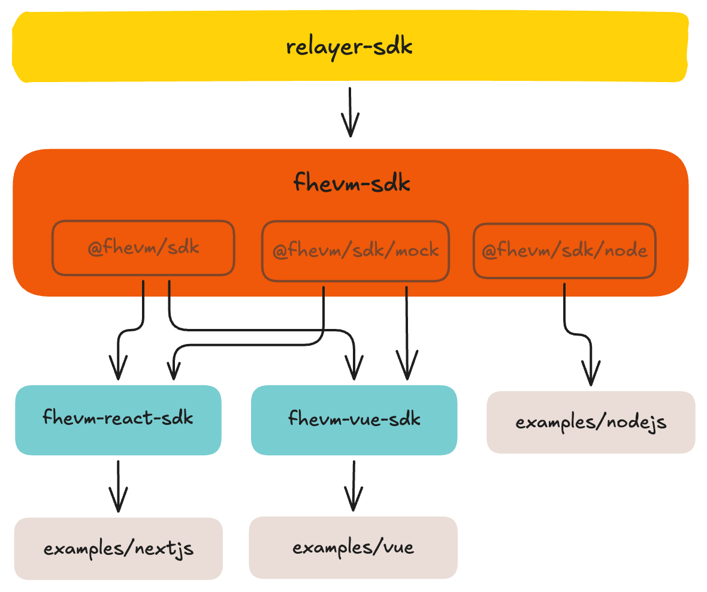

# FHEVM SDK

Collection of TypeScript SDKs for building dapps with Zama's FHEVM (Fully Homomorphic Encryption Virtual Machine), enabling smart contracts to compute on encrypted data with controlled decryption on Ethereum.

Includes three npm packages (`@fhevm/sdk`, `@fhevm/react-sdk`, `@fhevm/vue-sdk`) and working example dapps ([Next.js](./examples/nextjs), [Vue](./examples/vue), [Node.js CLI](./examples/nodejs)) demonstrating SDK usage with the [FHECounter contract](./packages/hardhat/contracts/FHECounter.sol) on localhost and Sepolia.

> **💡 Quick Testing**  
> Try the live demos on Sepolia testnet:
> - **Next.js Example**: [fhevm-sdk-nextjs-example.vercel.app](https://fhevm-sdk-nextjs-example.vercel.app/)
> - **Vue Example**: [fhevm-sdk-vue-example.vercel.app](https://fhevm-sdk-vue-example.vercel.app/)
> 
> Or skip to [Getting Started](#-getting-started) to run locally.

## 🧩 Architecture

<p align="center">
  
</p>

## 📦 Packages

### [`@fhevm/sdk`](./packages/fhevm-sdk)
Core framework-agnostic SDK. Use this if you're building with vanilla JS, custom frameworks, or need Node.js support. Handles FHEVM client initialization, encryption, and decryption.

### [`@fhevm/react-sdk`](./packages/fhevm-react-sdk)
React provider and hooks for Next.js and React apps. Use this for React projects to reduce boilerplate by ~60-85%. Includes `FhevmProvider` and set of hooks for encryption and decryption.

### [`@fhevm/vue-sdk`](./packages/fhevm-vue-sdk)
Vue composables and plugin for Vue 3 apps. Use this for Vue projects to simplify FHEVM integration. Includes plugin and composables for encryption and decryption.

## 📁 Repository Structure

This monorepo contains SDKs, examples, and local development infrastructure:

```
fhevm-sdk/
├── packages/
│   ├── fhevm-sdk/          # Core SDK (@fhevm/sdk)
│   ├── fhevm-react-sdk/    # React SDK (@fhevm/react-sdk)
│   ├── fhevm-vue-sdk/      # Vue SDK (@fhevm/vue-sdk)
│   └── hardhat/            # Local network and contracts
└── examples/
    ├── nextjs/             # Next.js example dapp
    ├── vue/                # Vue example dapp
    └── nodejs/             # Node.js CLI example
```

## 🚀 Getting Started

### Prerequisites

`Node.js v20+`, `pnpm`, `MetaMask` (for browser examples)

### Installation

```bash
# Clone the repository
git clone git@github.com:0xAleksaOpacic/FHEVM-SDK.git
cd FHEVM-SDK

# Initialize Hardhat submodule (local network and contracts)
git submodule update --init --recursive

# Install dependencies and build all SDK packages
pnpm install && pnpm build
```

### Network Setup

The example dapps support two network modes. Choose one below:

- **[Localhost Setup](#localhost-setup)** - Run with local Hardhat node (recommended for testing)
- **[Sepolia Setup](#sepolia-setup)** - Deploy and run on Sepolia testnet

### Localhost Setup

Run examples with a local Hardhat node. Contract addresses are deterministic, so examples work out of the box.

#### 1. Start Hardhat Node

```bash
pnpm chain
```

This starts a local Hardhat node on `http://127.0.0.1:8545` (Chain ID: `31337`) and deploys all FHEVM contracts. The FHECounter contract deploys to `0x5FbDB2315678afecb367f032d93F642f64180aa3`.

#### 2. Configure MetaMask

> **⚠️ Important**  
> Disable all other wallet extensions (Coinbase Wallet, Rabby, etc.) before using the examples. Multi-wallet support will be added in future releases.

Add the Hardhat network and import a test account. See [MetaMask Localhost Setup](./docs/metamask-localhost.md) for detailed instructions with screenshots.

### Sepolia Setup

Run examples on Sepolia testnet with a pre-deployed [FHECounter contract](./packages/hardhat/contracts/FHECounter.sol) or deploy your own.

> **📌 Pre-deployed Contract**  
> Contract address: `0x6134E9810A204661eaB5a189A44BB7F1CB2a4196`  
> Free RPC: `https://ethereum-sepolia-rpc.publicnode.com`

#### 1. Configure Environment Variables

Create `.env.local` (Next.js/Vue) or `.env` (Node.js) from `env.example` in your chosen example directory:

```bash
## Next.js (`examples/nextjs/.env.local`):
NEXT_PUBLIC_NETWORK_MODE=sepolia

## Vue (`examples/vue/.env.local`):
VITE_NETWORK_MODE=sepolia

## Node.js (`examples/nodejs/.env`):
NETWORK_MODE=sepolia
PRIVATE_KEY=your_private_key_here
```

> **⚠️ Node.js requires PRIVATE_KEY**  
> Unlike browser examples that use MetaMask, Node.js needs a private key for signing transactions.

See `.env.example` files for optional overrides (custom RPC URL, custom contract address).

#### 2. Configure MetaMask

> **⚠️ Important**  
> Set MetaMask to Sepolia testnet only. Multi-network support will be added in future releases.

Switch MetaMask to Sepolia and ensure you have test ETH. See [MetaMask Sepolia Setup](./docs/metamask-sepolia.md) for detailed instructions.

#### 3. Deploy Your Own Contract (Optional)

To deploy your own `FHECounter` contract instead of using the pre-deployed one, see [Deploy to Sepolia Guide](./docs/deploy-sepolia.md).

### Running Examples

After completing either [Localhost Setup](#localhost-setup) or [Sepolia Setup](#sepolia-setup), run the examples:

**Node.js CLI:**
```bash
pnpm nodejs-example
```

**Next.js:**
```bash
pnpm nextjs-example
```

**Vue:**
```bash
pnpm vue-example
```

## 📚 Additional Resources

### Project Documentation
- [Roadmap](./docs/roadmap.md) - Planned features and improvements
- [Deploy to Sepolia](./docs/deploy-sepolia.md) - Deploy your own FHECounter contract

### Official Documentation
- [FHEVM Documentation](https://docs.zama.ai/protocol/solidity-guides/) - Complete FHEVM guide
- [FHEVM Hardhat Guide](https://docs.zama.ai/protocol/solidity-guides/development-guide/hardhat) - Hardhat integration
- [Relayer SDK Documentation](https://docs.zama.ai/protocol/relayer-sdk-guides/) - Relayer SDK reference

### Community & Support
- [FHEVM Discord](https://discord.com/invite/zama) - Community support
- [GitHub Issues](https://github.com/0xAleksaOpacic/FHEVM-SDK/issues) - Bug reports & feature requests

## 📄 License

This project is licensed under the **BSD-3-Clause-Clear License**. See the [LICENSE](LICENSE) file for details.
