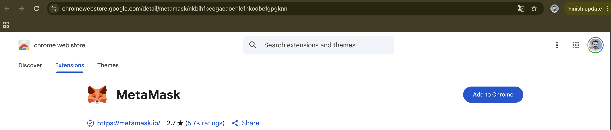
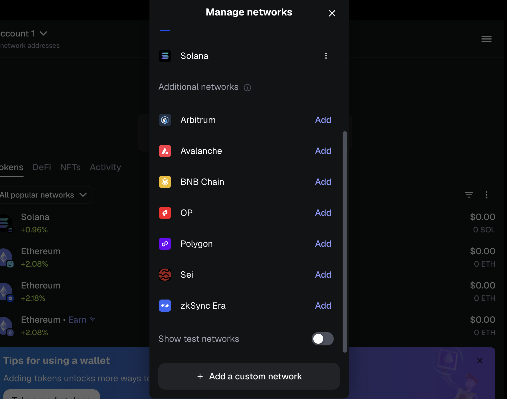
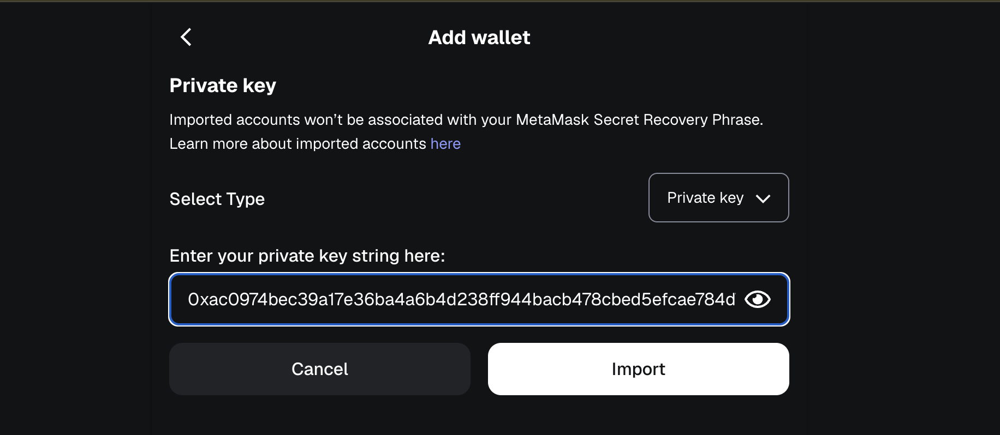

# MetaMask Localhost Setup

Guide to configure MetaMask for local Hardhat development.

## 1. Install MetaMask

Download and install MetaMask browser extension from [metamask.io](https://metamask.io/download/).



## 2. Add Hardhat Network

1. Open MetaMask and click the network dropdown (top left)
2. Click **"Add network"**
3. Click **"Add a network manually"** at the bottom
4. Enter the following details:

   - **Network Name:** `Hardhat Local`
   - **RPC URL:** `http://127.0.0.1:8545`
   - **Chain ID:** `31337`
   - **Currency Symbol:** `ETH`

5. Click **"Save"**



## 3. Import Test Account

Hardhat provides test accounts with ETH. Import the first account:

1. Open MetaMask and click the account dropdown
2. Click **"Import Account"**
3. Enter this private key:

   ```
   0xac0974bec39a17e36ba4a6b4d238ff944bacb478cbed5efcae784d7bf4f2ff80
   ```

4. Click **"Import"**



This account has 9,999.999 ETH for testing and corresponds to address `0xf39Fd6e51aad88F6F4ce6aB8827279cffFb92266`.

## Troubleshooting

### Nonce Errors

If you restart Hardhat and get nonce errors:

1. Go to MetaMask **Settings** → **Advanced**
2. Click **"Clear activity tab data"**

