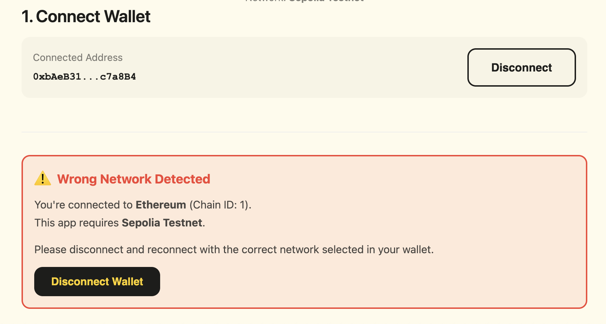
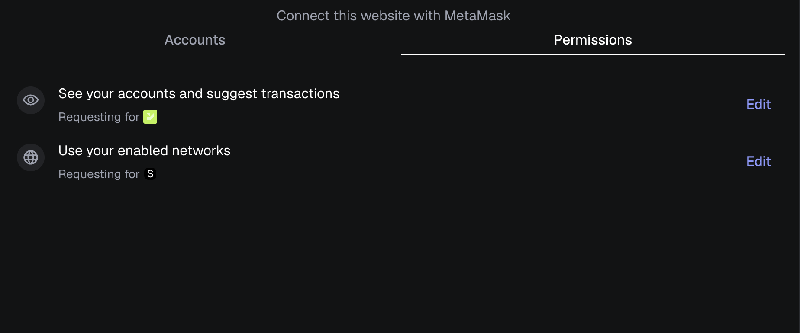
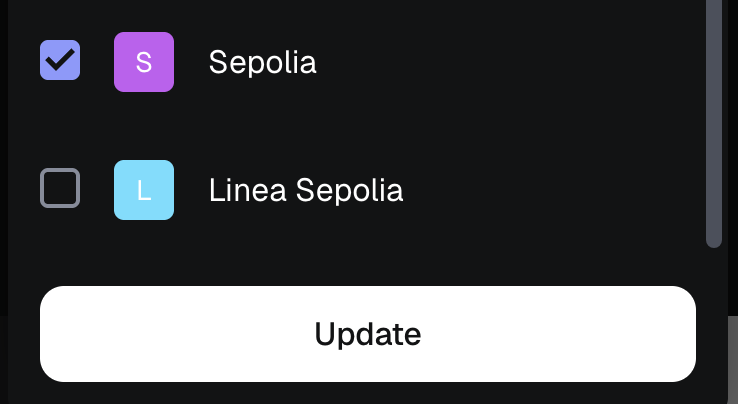
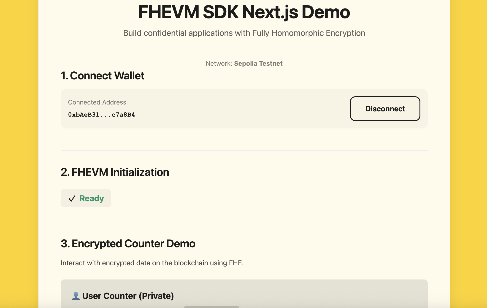

# MetaMask Sepolia Connection Troubleshooting

This guide helps you connect to the correct network when using the FHEVM examples.

## Problem: "Wrong Network Detected" Error

If you see this red warning banner in the app:

This means MetaMask is connected to the wrong network (e.g., Ethereum Mainnet instead of Sepolia).

---

## Solution: Reconnect with Correct Network

### Step 1: Disconnect Wallet

Click the **"Disconnect Wallet"** button in the app (either in the wallet info section or in the warning banner).

### Step 2: Connect and Select Only Sepolia

Click **"Connect Wallet"** again. In the MetaMask connection popup, **go to permisisons tab** and select edit networks

**Select only Sepolia test network** from the list of available networks.

### Step 3: Success!

You should now see the app connected successfully without any warning. The FHEVM initialization will proceed and you can use the encrypted counter demo.

---

## Why Does This Happen?

The FHEVM examples are configured to work on **Sepolia Testnet** only. When MetaMask connects on a different network (like Mainnet, Polygon, etc.), the app detects the mismatch and shows a warning to protect you from sending transactions to the wrong network.

---

## Still Having Issues?

- Make sure you have Sepolia ETH in your wallet ([Get test ETH](./metamask-sepolia.md#get-sepolia-eth))
- Check that MetaMask is the only wallet extension enabled
- Try refreshing the page after switching networks

