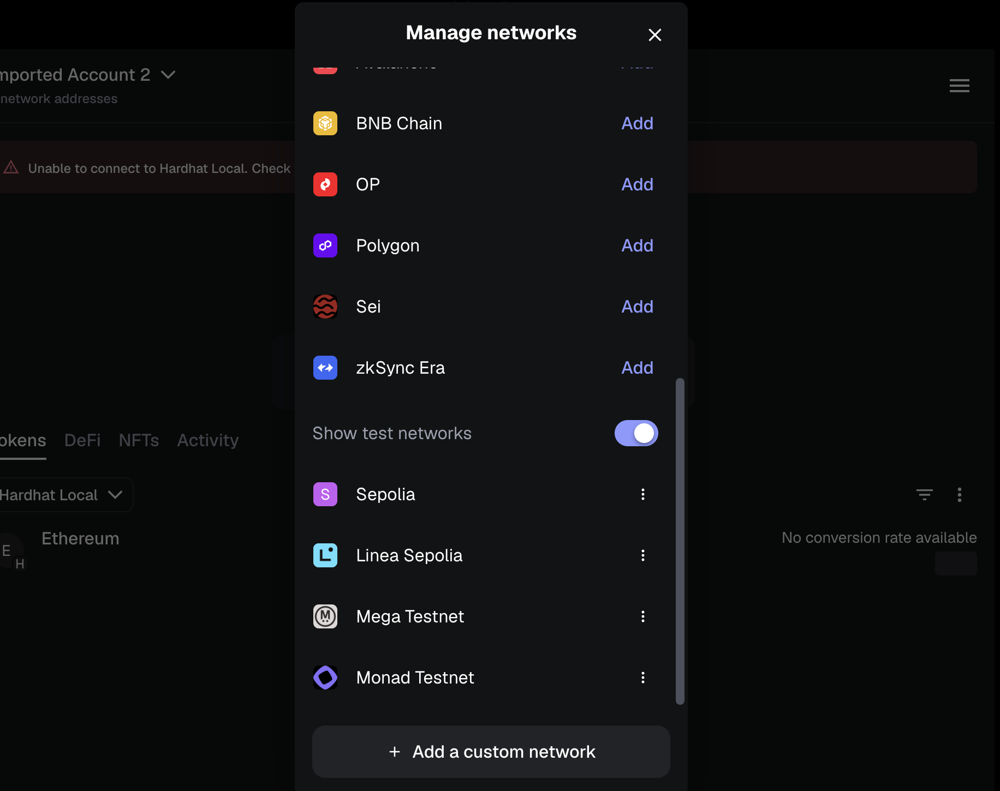
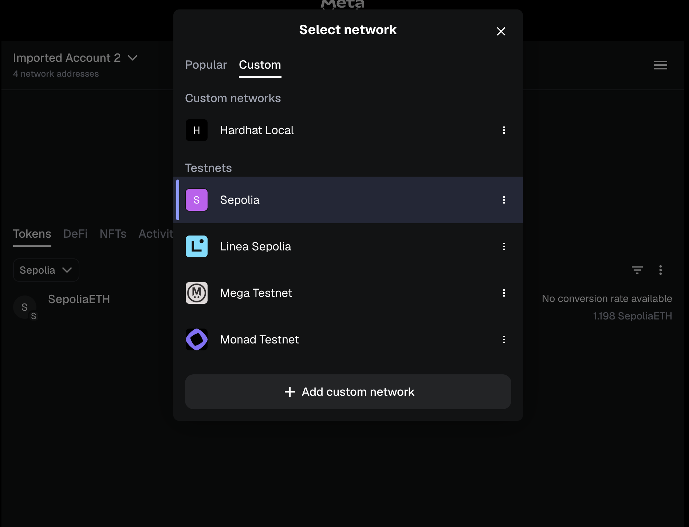

# MetaMask Sepolia Setup

Guide to configure MetaMask for Sepolia testnet.

## 1. Install MetaMask

If not already installed, download MetaMask from [metamask.io](https://metamask.io/download/).

## 2. Add Sepolia Network

MetaMask includes Sepolia by default. To enable it:

1. Open MetaMask and click the network dropdown (top left)
2. Click **"Show test networks"** toggle in settings if Sepolia is not visible

## 3. Get Test ETH

Request test ETH from a Sepolia faucet:

- [Alchemy Sepolia Faucet](https://sepoliafaucet.com/)
- [QuickNode Sepolia Faucet](https://faucet.quicknode.com/ethereum/sepolia)
- [Infura Sepolia Faucet](https://www.infura.io/faucet/sepolia)

Most faucets require social verification (GitHub, Twitter) and provide 0.5 ETH per day.

## 4. Check Tokens on Sepolia

After connecting to the dapp and interacting with encrypted values:

1. Go to your account and select **"Tokens"** tab
2. Click the network dropdown
3. Select **"Custom"** → **"Sepolia"**

This allows you to view tokens

