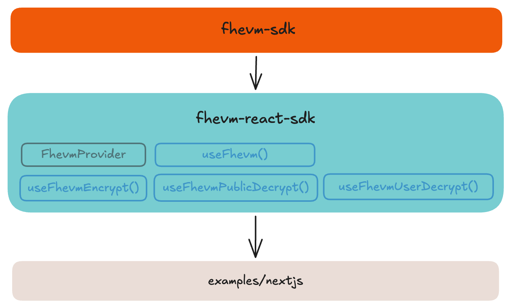

# @fhevm/react-sdk

React hooks and provider for FHEVM integration built on top of [@fhevm/sdk](../fhevm-sdk). Reduces boilerplate by 60-85% compared to using the core SDK directly through a provider pattern that manages client lifecycle, encryption/decryption hooks with built-in loading states, and automatic type conversions for handle formatting and signer creation. Designed for Next.js, Create React App, Vite, and other React applications.

## 📦 Installation

> **Note:** Packages are not published to npm yet. Use the monorepo workspace for development.

```bash
pnpm add @fhevm/react-sdk
```

## 🧩 Architecture

<p align="center">
  
</p>

## 🚀 Quick Start

```tsx
import { FhevmProvider, useFhevmEncrypt, useFhevmUserDecrypt } from '@fhevm/react-sdk';
import { useAccount } from 'wagmi';

function App() {
  return (
    <FhevmProvider network="localhost" rpcUrl="http://localhost:8545">
      <Counter />
    </FhevmProvider>
  );
}

function Counter() {
  const { address } = useAccount();
  const { createInput, isReady } = useFhevmEncrypt({
    contractAddress: '0x5FbDB2315678afecb367f032d93F642f64180aa3',
  });
  const { decrypt } = useFhevmUserDecrypt({
    contractAddress: '0x5FbDB2315678afecb367f032d93F642f64180aa3',
    cacheType: 'session',
  });

  async function handleEncrypt() {
    if (!isReady || !address) return;
    
    const input = createInput(address);
    input.add32(1);
    const { handles, inputProof } = await input.encrypt();
    
    // Use in contract call
    await contract.increment(handles[0], inputProof);
  }

  async function handleDecrypt(handle: string) {
    const value = await decrypt(handle);
    console.log('Decrypted:', value);
  }

  return (
    <div>
      <button onClick={handleEncrypt}>Encrypt</button>
      <button onClick={() => handleDecrypt('0x...')}>Decrypt</button>
    </div>
  );
}
```

## 📚 API Reference

### Components
- **[FhevmProvider](./docs/provider.md)** - Context provider for managing FHEVM client lifecycle

### Hooks
- **[useFhevm](./docs/useFhevm.md)** - Access client instance and status
- **[useFhevmEncrypt](./docs/useFhevmEncrypt.md)** - Create encrypted inputs for contracts
- **[useFhevmUserDecrypt](./docs/useFhevmUserDecrypt.md)** - Decrypt with user signature (EIP-712)
- **[useFhevmPublicDecrypt](./docs/useFhevmPublicDecrypt.md)** - Decrypt public values (no signature)

## 📁 Folder Structure

```
packages/fhevm-react-sdk/
├── src/
│   ├── FhevmProvider.tsx       # Context provider component
│   ├── FhevmContext.ts          # React Context definition
│   └── hooks/
│       ├── useFhevm.ts          # Access client from context
│       ├── useFhevmEncrypt.ts   # Encryption hook
│       ├── useFhevmUserDecrypt.ts   # User decryption hook
│       └── useFhevmPublicDecrypt.ts # Public decryption hook
└── docs/                        # Detailed API documentation
```

## 📖 Example

See the [Next.js example](../../examples/nextjs) for a complete working implementation with Wagmi integration.
