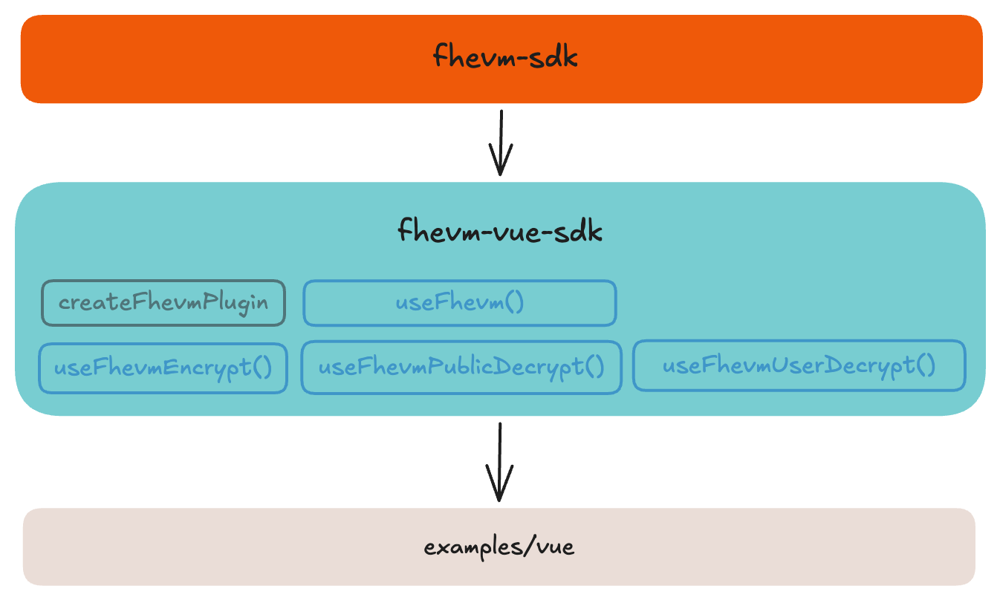

# @fhevm/vue-sdk

Vue composables and plugin for FHEVM integration built on top of [@fhevm/sdk](../fhevm-sdk). Reduces boilerplate by 60-85% compared to using the core SDK directly through a plugin pattern that manages client lifecycle, encryption/decryption composables with built-in reactive states, and automatic type conversions for handle formatting and signer creation. Designed for Vue 3, Nuxt 3, Vite, and other Vue applications.

## 📦 Installation

> **Note:** Packages are not published to npm yet. Use the monorepo workspace for development.

```bash
pnpm add @fhevm/vue-sdk
```

## 🧩 Architecture

<p align="center">
  
</p>


## 🚀 Quick Start

**Step 1:** Initialize polyfills in your `main.ts`:

```typescript
import { initFhevmPolyfills } from '@fhevm/vue-sdk';

// Initialize polyfills before any other imports
initFhevmPolyfills();

import { createApp } from 'vue';
import { createFhevmPlugin } from '@fhevm/vue-sdk';
// ... rest of your imports
```

**Step 2:** Use composables in your components:

```vue
<script setup lang="ts">
import { useFhevmEncrypt, useFhevmUserDecrypt } from '@fhevm/vue-sdk';

const { createInput, isReady } = useFhevmEncrypt({
  contractAddress: '0x5FbDB2315678afecb367f032d93F642f64180aa3',
});

const { decrypt } = useFhevmUserDecrypt({
  contractAddress: '0x5FbDB2315678afecb367f032d93F642f64180aa3',
  cacheType: 'session',
});

async function handleEncrypt() {
  if (!isReady.value || !userAddress.value) return;
  
  const input = createInput(userAddress.value);
  input.add32(1);
  const { handles, inputProof } = await input.encrypt();
  
  // Use in contract call
  await contract.increment(handles[0], inputProof);
}

async function handleDecrypt(handle: string) {
  const value = await decrypt(handle);
  console.log('Decrypted:', value);
}
</script>

<template>
  <div>
    <button @click="handleEncrypt">Encrypt</button>
    <button @click="handleDecrypt('0x...')">Decrypt</button>
  </div>
</template>
```

### Plugin Setup

```typescript
// main.ts
import { createApp } from 'vue';
import { createFhevmPlugin } from '@fhevm/vue-sdk';
import App from './App.vue';

const app = createApp(App);

app.use(createFhevmPlugin({
  network: 'localhost',
  rpcUrl: 'http://localhost:8545',
}));

app.mount('#app');
```

## 📚 API Reference

### Plugin
- **[createFhevmPlugin](./docs/plugin.md)** - Vue plugin for managing FHEVM client lifecycle

### Composables
- **[useFhevm](./docs/useFhevm.md)** - Access client instance and status
- **[useFhevmEncrypt](./docs/useFhevmEncrypt.md)** - Create encrypted inputs for contracts
- **[useFhevmUserDecrypt](./docs/useFhevmUserDecrypt.md)** - Decrypt with user signature (EIP-712)
- **[useFhevmPublicDecrypt](./docs/useFhevmPublicDecrypt.md)** - Decrypt public values (no signature)

## 📁 Folder Structure

```
packages/fhevm-vue-sdk/
├── src/
│   ├── plugin.ts                # Vue plugin for global setup
│   └── composables/
│       ├── useFhevm.ts          # Access client from injection
│       ├── useFhevmEncrypt.ts   # Encryption composable
│       ├── useFhevmUserDecrypt.ts   # User decryption composable
│       └── useFhevmPublicDecrypt.ts # Public decryption composable
└── docs/                        # Detailed API documentation
```

## 📖 Example

See the [Vue example](../../examples/vue) for a complete working implementation with Viem integration.

